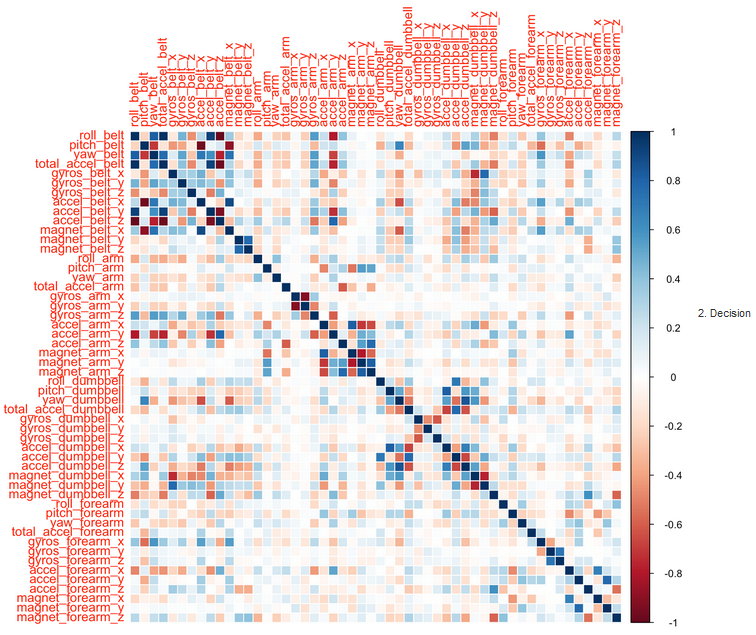

#Practical Machine Learning Project

####*Xavier Vela*
####*August, 2015*

##Synopsis

Using devices such as Jawbone Up, Nike FuelBand, and Fitbit it is now possible to collect a large amount of data about personal activity relatively inexpensively. These type of devices are part of the quantified self movement – a group of enthusiasts who take measurements about themselves regularly to improve their health, to find patterns in their behavior, or because they are tech geeks. One thing that people regularly do is quantify how much of a particular activity they do, but they rarely quantify how well they do it. In this project, the goal will be to use data from accelerometers on the belt, forearm, arm, and dumbell of 6 participants. They were asked to perform barbell lifts correctly and incorrectly in 5 different ways. More information is available from the website here: http://groupware.les.inf.puc-rio.br/har (see the section on the Weight Lifting Exercise Dataset). 

##Getting and Cleaning the Data

####Load the required libraries and the data

```{r,echo=TRUE,results='hold',warning=F,message=F,tidy=TRUE,fig.align='center'}
setwd("G:/Xavier/Estudios/Online/Data Science/8 Practical Machine Learning/project")
library(caret)
trainRaw <- read.csv("./data/pml-training.csv")
testRaw <- read.csv("./data/pml-testing.csv")
```

```{r,echo=TRUE,results='hold',warning=F,message=F,tidy=TRUE,fig.align='center'}
dim(trainRaw)
dim(testRaw)
```

####Remove columns with majority of NAs or blank values

First, we will remove the columns with more than 90% NAs or 90% Blank cells.

Columns with majority of NAs:

```{r,echo=TRUE,results='hold',warning=F,message=F,tidy=TRUE,fig.align='center'}
nas_incolumn <- apply(trainRaw, 2, function(x) length(x[is.na(x)]))
not_na <- names(nas_incolumn[nas_incolumn < nrow(trainRaw) * 0.9])
trainRaw <- trainRaw[, not_na]
nas_incolumn <- apply(testRaw, 2, function(x) length(x[is.na(x)]))
not_na <- names(nas_incolumn[nas_incolumn < nrow(testRaw) * 0.9])
testRaw <- testRaw[, not_na]
```

Columns with majority of blanks:

```{r,echo=TRUE,results='hold',warning=F,message=F,tidy=TRUE,fig.align='center'}
blanks_incolumn <- apply(trainRaw, 2, function(x) length(x[x==""]))
not_blank <- names(blanks_incolumn[blanks_incolumn < nrow(trainRaw) * 0.9])
trainRaw <- trainRaw[, not_blank]
blanks_incolumn <- apply(testRaw, 2, function(x) length(x[x==""]))
not_blank <- names(blanks_incolumn[blanks_incolumn < nrow(testRaw) * 0.9])
testRaw <- testRaw[, not_blank]
```

####Remove nearzerovar columns and string columns

Now, we will remove the columns with string cells and near zero var (if there is any).

```{r,echo=TRUE}
#remove nearzerovar columns
nzv <- nearZeroVar(trainRaw, saveMetrics = TRUE)
nzv[nzv$nzv==TRUE,]
removeCol <- grepl("user_name|window|timestamp|^X", names(trainRaw))
trainClean <- trainRaw[, !removeCol]
testClean <- testRaw[, !removeCol]
head(trainClean, 2)
#head(testClean, 2)
```

##Data Modeling and Predicting

####Data splitting

We will divide our data from pml-training.csv (cleaned) into two sets: 70% training set and 30% testing set; that is for doing cross validation.

```{r,echo=TRUE,results='hold',warning=F,message=F,tidy=TRUE,fig.align='center'}
set.seed(321)
inTrain <- createDataPartition(trainClean$classe, p=0.70, list=F)
trainingSet <- trainClean[inTrain, ]
testingSet <- trainClean[-inTrain, ]
```

####Fitting the model

We fit a predictive model using a 5 fold Random Forest algorithm. This algorithm is one of the top performing algorithms. The variable we are trying to predict is "classe" and it can be five types: A, B, C, D or E.

```{r,echo=TRUE,results='hold',warning=F,message=F,tidy=TRUE,fig.align='center'}
control1 <- trainControl(method="cv", 5)
model1 <- train(classe ~ ., data=trainingSet, method="rf", trControl=control1, ntree=250)
model1
```

####Predicting for the internal testing set

This step is for predicting the performance of the model in the testing set. The Confusion Matrix shows us the correct and bad predictions, besides, it shows the overall accuracy of the prediction.

```{r,echo=TRUE,results='hold',warning=F,message=F,tidy=TRUE,fig.align='center'}
predict1 <- predict(model1, testingSet)
res <- confusionMatrix(testingSet$classe, predict1)
res
```

####Prediction accuracy and error

**Accuracy**

```{r,echo=TRUE,results='hold',warning=F,message=F,tidy=TRUE,fig.align='center'}
res[3]
accuracy <- res[3]$overall[1]
accuracy
```

**Expected out of sample error**

```{r,echo=TRUE,results='hold',warning=F,message=F,tidy=TRUE,fig.align='center'}
error <- 1 - accuracy
error
```

##Predicting for the external testing set: pml-testing.csv

Now, we will probe our model in another testing set: file pml-testing.csv.

```{r,echo=TRUE,results='hold',warning=F,message=F,tidy=TRUE,fig.align='center'}
predict(model1, testClean)
```

##Appendix: Figures

**1) Correlations diagram**

```{r,echo=TRUE,results='hold',warning=F,message=F,tidy=TRUE,fig.align='center'}
removeCol <- grepl("classe", names(trainClean))
trainClean1 <- trainClean[, !removeCol]
M <- cor(trainClean1)
#library(corrplot)
#corrplot(M, method="circle")
```



**2) Tree diagram**

```{r,echo=TRUE,results='hold',warning=F,message=F,tidy=TRUE,fig.align='center'}
library(rpart)
library(rattle)
treeModel <- train(classe ~ ., data=trainingSet, method="rpart")
fancyRpartPlot(treeModel$finalModel)
```
